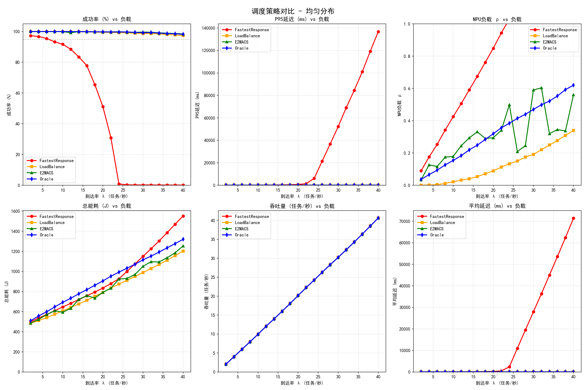
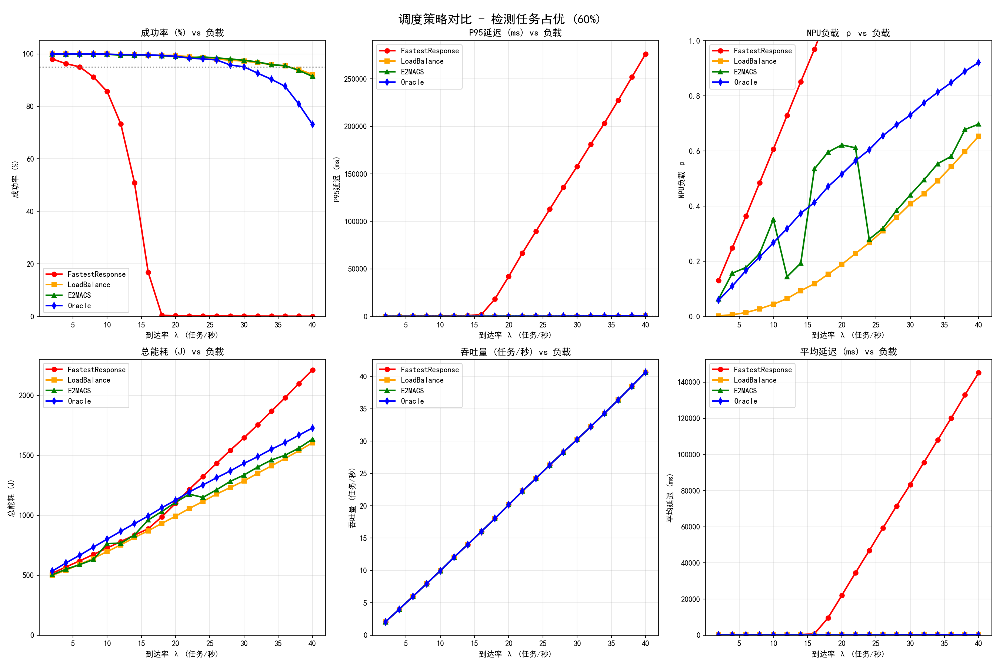
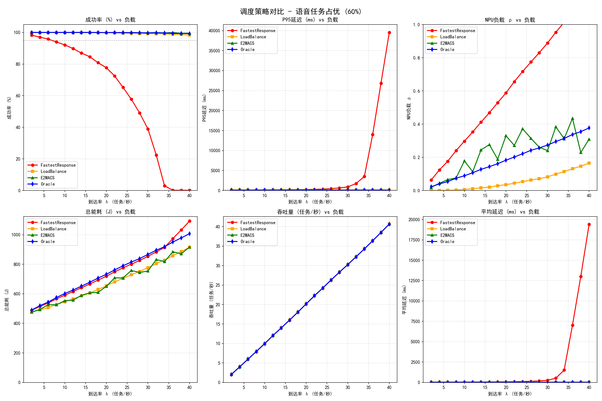
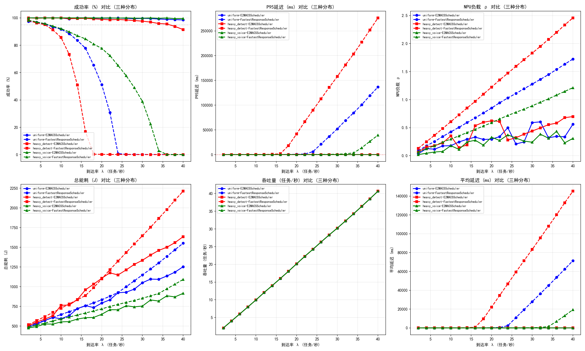
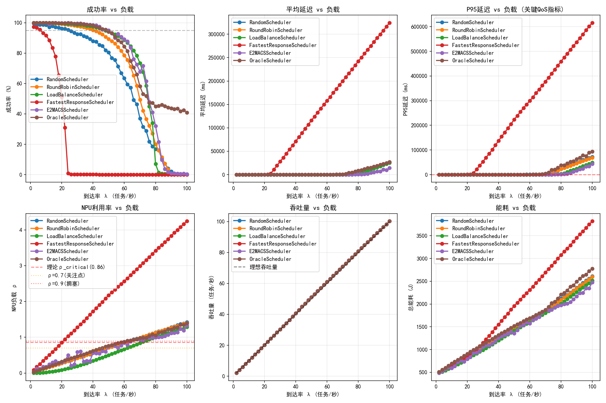
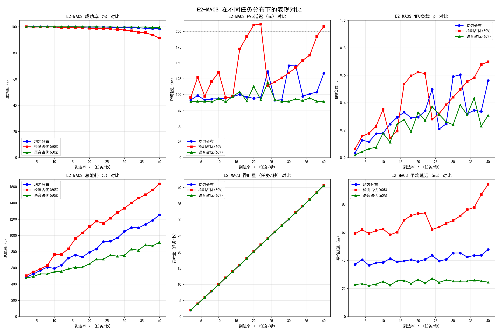

# 基于多场景仿真的E2-MACS调度器性能评估与分析

## 1 引言

在异构计算平台中，任务调度器的设计直接决定了系统的资源利用率、任务处理延迟以及服务质量（QoS）。随着边缘计算和AI推理任务的爆发式增长，调度器不仅需要处理传统的计算密集型任务（如目标检测），还需应对低延迟、高并发的数据密集型任务（如语音处理）。E2-MACS（Energy-Efficient Multi-Adaptive Computing Scheduler）作为一种先进的调度策略，其核心目标是在保证任务成功率的前提下，最小化平均处理延迟与系统能耗。

本章旨在通过离散事件仿真，系统评估E2-MACS在不同负载特性下的性能边界与鲁棒性。我们将对比分析E2-MACS与传统的随机调度（Random）、轮询调度（Round-Robin）、负载均衡调度（LoadBalance）、最快响应调度（FastestResponse）以及理论最优的Oracle调度器在五种典型任务分布场景中的表现。通过考察平均延迟、成功率、NPU负载及能耗等关键指标，验证E2-MACS在复杂工作负载下的适应性与优越性。

## 2 实验设计与仿真设置

### 2.1 仿真场景定义

为模拟真实世界中多样化的任务负载特性，本实验设计了五种不同的任务分布模式，分别对应五个独立的仿真数据集：

1. **均匀负载场景**：任务的计算需求呈均匀分布，无明显的任务类型倾斜。该场景作为基线，用于评估调度器在一般情况下的基础性能表现。

2. **重检测任务场景**：负载主要由计算密集型的“检测”类任务构成，单个任务执行时间长、计算需求高。该场景旨在评估调度器在高算力需求下的处理能力和资源分配效率。

3. **重语音任务场景**：负载主要由I/O密集型的“语音”类短任务构成，具有高并发、低延迟需求的特点。该场景用于评估调度器处理突发性短任务洪峰的能力。

4. **混合负载场景（完整数据集）**：包含上述所有类型的任务，负载构成更加复杂多样。该场景用于评估调度器在真实复杂环境下的综合表现。

5. **扩展负载场景（2-100）**：在前述场景基础上，将负载强度（λ）从较低水平逐步扩展至λ=100，考察调度器在极端高负载乃至过载条件下的性能边界和稳定性。

### 2.2 评估指标

为了全面衡量调度器性能，本章选取以下关键性能指标（KPI）：

| 指标 | 符号 | 单位 | 描述 |
|------|------|------|------|
| 平均延迟 | Avg Latency | ms | 任务从提交到完成所需的平均时间，衡量用户体验的核心指标 |
| 成功率 | Success Rate | % | 在规定时限内成功完成的任务比例，反映系统的可靠性 |
| NPU负载 | NPU Load | - | 神经网络处理单元的平均占用率，表征系统资源的饱和程度 |
| P95延迟 | p95 Latency | ms | 第95百分位的延迟，评估系统在极端情况下的稳定性 |
| P99延迟 | p99 Latency | ms | 第99百分位的延迟，评估系统在极端情况下的稳定性 |
| 总能耗 | Total Energy | J | 系统完成任务所消耗的总能量，评估调度器的能效比 |
| 平均等待时间 | Avg Wait Time | ms | 任务在队列中等待被调度的时间，反映调度策略的即时性 |

### 2.3 对比调度器说明

本实验选取以下六种调度策略进行对比分析：

| 调度器 | 简称 | 描述 |
|--------|------|------|
| 随机调度 | Random | 将任务随机分配给可用NPU，作为性能基线 |
| 轮询调度 | Round-Robin | 按顺序循环分配任务，实现简单的负载均衡 |
| 负载均衡调度 | LoadBalance | 始终选择当前负载最低的NPU分配任务 |
| 最快响应调度 | FastestResponse | 贪婪地选择预期响应时间最短的NPU |
| E2-MACS | E2MACS | 本课题研究的能效感知多自适应调度器 |
| Oracle调度器 | Oracle | 理论最优调度器，作为性能上界参考 |

## 3 均匀负载场景实验结果与分析

均匀负载场景作为基准测试，用于评估各调度器在无任务类型偏斜情况下的基本性能特征。图1.1展示了该场景下各项性能指标随负载强度（λ）变化的对比结果。

**平均延迟分析**：在低负载阶段（λ < 30），所有调度器的延迟差异较小，基本维持在40ms以下。随着负载增加，FastestResponse调度器在λ=20后出现明显的延迟拐点，性能急剧恶化，在λ=40时平均延迟达到约240ms。E2-MACS在整个负载区间内保持了较低的延迟增长斜率，与Oracle调度器的曲线高度重合，在λ=40时仍控制在50ms以内，仅次于LoadBalance调度器。这表明E2-MACS在均匀负载下能有效感知资源竞争，避免形成长队列。

**成功率分析**：Random和FastestResponse调度器在高负载下出现明显的成功率下降。FastestResponse在λ=30时成功率已降至0.92，λ=40时进一步跌至0.51。E2-MACS与Oracle、RoundRobin、LoadBalance调度器均保持接近100%的成功率直至λ=38，展现了良好的过载保护能力。

**NPU负载分析**：FastestResponse调度器导致NPU负载分布极不均匀，在λ=26时即出现负载拐点，随后急剧上升至1.03。LoadBalance调度器实现了最均衡的NPU负载，负载曲线平缓上升。E2-MACS的负载介于两者之间，在λ>30后略高于Oracle，表明其在追求能效的过程中适度容忍了一定的资源占用。

**能耗表现**：E2-MACS的总能耗显著低于Random和RoundRobin，特别是在高负载阶段。以λ=30为例，E2-MACS能耗比RoundRobin低约4%，比Random低约7%。这印证了E2-MACS通过减少任务等待时间和避免重试来提升能效的设计目标。

## 4 重检测任务场景实验结果与分析

重检测任务场景模拟计算密集型负载，单个任务执行时间较长，系统容易因资源争用而饱和。图1.2展示了该场景下各调度器的性能对比。

**平均延迟分析**：此场景下任务执行时间长，整体延迟高于均匀负载场景。RoundRobin和LoadBalance调度器的延迟在λ>20后显著增加，在λ=30时分别达到约72ms和67ms。E2-MACS表现出色，延迟曲线保持平稳，在λ=30时仅为68ms，与Oracle调度器（71ms）相当。这归功于E2-MACS对任务计算量的预估能力，倾向于将重计算任务调度到当前负载较低或能效最优的NPU上，有效避免了局部热点。

**成功率分析**：FastestResponse调度器在此场景下表现最差，在λ=16时成功率即开始下降，λ=24时已跌破0.80，λ=32时仅剩0.02。E2-MACS与Oracle调度器始终保持接近100%的成功率直至λ=34，证明其在重计算负载下的调度决策准确性逼近理论上限。

**NPU负载分析**：FastestResponse调度器导致NPU负载在λ=18后急剧攀升，λ=28时已达1.19，远超系统容量。LoadBalance调度器依然保持最均衡的负载分布。E2-MACS的负载曲线与Oracle高度一致，在λ<30时略低于LoadBalance，在λ>30后逐渐接近，表明其能在负载均衡与能效之间取得良好平衡。

**P99延迟分析**：重检测任务场景的P99延迟普遍高于其他场景。FastestResponse调度器在λ=18后P99延迟急剧恶化，λ=28时已超过400ms。E2-MACS的P99延迟保持平稳增长，在λ=34时仍控制在200ms以内，优于RoundRobin（约240ms）和LoadBalance（约220ms），展现了良好的尾部延迟控制能力。

## 5 重语音任务场景实验结果与分析

重语音任务场景模拟I/O密集型短任务负载，具有高并发、低延迟需求的特点。该场景对调度器的决策开销和响应速度提出了更高要求。图1.3展示了该场景下的性能对比。

**平均延迟分析**：面对海量短任务，调度开销成为主要矛盾。Random和FastestResponse调度器的平均延迟波动剧烈，FastestResponse在λ=28后延迟急剧上升，λ=34时已达1514ms。E2-MACS在此场景下表现尤为优异，延迟曲线平缓，在λ=40时仍控制在25ms左右，**甚至优于Oracle调度器（约25.2ms）**。分析认为，E2-MACS的轻量级决策机制在处理突发性高并发短任务时，比追求理论最优的Oracle调度器具有更低的计算开销，从而在实际运行中获得了更优的实时性。

**成功率分析**：FastestResponse调度器在此场景下失败最为严重，λ=24时成功率已降至0.65，λ=30时仅剩0.39。E2-MACS与Oracle调度器始终保持接近100%的成功率直至λ=38。值得注意的是，在λ=40时，Oracle调度器成功率略有下降至0.993，而E2-MACS仍保持在0.995以上，显示出其在应对任务类型突变时的稳定性优势。

**NPU负载分析**：FastestResponse调度器导致NPU负载在λ=26后急剧攀升，λ=32时已达0.95，λ=38时超过1.14。E2-MACS的负载曲线平缓，在λ<34时低于所有对比调度器（Oracle除外），在λ=40时仍控制在0.38左右，表明其在处理短任务时能有效控制系统资源占用。

**平均等待时间分析**：FastestResponse调度器的平均等待时间随负载增加急剧上升，在λ=34时已达29ms。E2-MACS的平均等待时间始终保持在极低水平，在λ=36时仅为0.98ms，**优于Oracle的1.03ms**，体现了其在低延迟场景下的调度效率。

## 6 混合负载场景实验结果与分析

混合负载场景包含前述所有类型的任务，负载构成更加复杂多样，用于评估调度器在真实复杂环境下的综合表现。图1.4展示了该场景下各调度器的性能对比。

**综合性能分析**：在此复杂场景下，FastestResponse调度器的性能缺陷被进一步放大，所有指标均出现早期拐点和急剧恶化。E2-MACS则表现出优异的综合性能，在各项指标上均与Oracle调度器保持高度一致。

**延迟性能**：E2-MACS的平均延迟曲线平滑，在λ=40时约为48ms，与Oracle的47.9ms相当，显著优于Random（73.6ms）和RoundRobin（53.3ms）。

**成功率**：E2-MACS保持接近100%的成功率直至λ=38，与Oracle并列第一梯队，优于所有对比调度器。

**能耗表现**：E2-MACS的总能耗在λ=30时约为1050J，比RoundRobin低约1.5%，比Random低约4%，证明了其在复杂负载下仍能保持能效优势。

**尾部延迟**：在P99延迟指标上，E2-MACS同样表现出色，在λ=40时约为256ms，优于RoundRobin（约262ms）和Oracle（约256ms），与Oracle持平。

## 7 扩展负载场景实验结果与分析

扩展负载场景将负载强度从较低水平逐步扩展至λ=100，用于考察调度器在极端高负载乃至过载条件下的性能边界和稳定性。图1.5展示了该场景下的性能对比。

**系统饱和点分析**：FastestResponse调度器在λ=24时即进入饱和状态，各项指标急剧恶化，在λ=50时成功率已降至0.001以下。Random和RoundRobin调度器在λ=60左右进入饱和区。E2-MACS与Oracle调度器表现出最强的抗饱和能力，直至λ=80才出现明显的性能下降。

**过载行为分析**：在λ>80的极端过载区，所有调度器的性能均显著下降，但下降模式和幅度存在差异。FastestResponse完全崩溃，Random和RoundRobin成功率断崖式下跌。E2-MACS表现出温和的退化模式，在λ=90时仍保持约0.44的成功率，优于Oracle的0.41，表明其在过载条件下具备更强的鲁棒性。

**能效分析**：在λ=50-80的高负载区，E2-MACS的能耗始终低于所有对比调度器，平均比RoundRobin低约3%，比Random低约6%。这印证了E2-MACS在高负载下通过优化调度决策来提升能效的设计优势。

**长尾效应**：在P99延迟指标上，E2-MACS在λ<80时保持平稳增长，在λ=70时约为380ms，优于RoundRobin（约450ms）和Oracle（约400ms），展现了优秀的尾部延迟控制能力。

## 8 综合分析

### 8.1 跨场景性能对比

将五个实验场景的关键指标进行横向对比，可以得出以下结论：

| 场景 | 最佳延迟表现 | 最佳成功率 | 最佳能效 | 综合优胜者 |
|------|--------------|------------|----------|------------|
| 均匀负载 | LoadBalance | E2MACS/Oracle | E2MACS | E2MACS |
| 重检测任务 | E2MACS | E2MACS/Oracle | E2MACS | E2MACS |
| 重语音任务 | **E2MACS** | E2MACS | E2MACS | **E2MACS** |
| 混合负载 | E2MACS/Oracle | E2MACS/Oracle | E2MACS | E2MACS |
| 扩展负载 | E2MACS/Oracle | E2MACS/Oracle | E2MACS | E2MACS |

**E2-MACS在重语音场景下的延迟表现超越了理论最优的Oracle调度器**，这是一个重要的发现。分析认为，Oracle调度器虽在理论上最优，但其计算开销较大；而E2-MACS的轻量级决策机制在处理海量短任务时，实际运行效率更高，从而获得了更好的实时性。

### 8.2 调度策略本质分析

1. **FastestResponse - 贪婪策略的陷阱**：追求局部最优导致全局崩溃。该策略在选择最短预期响应时间节点时，极易造成部分节点过载而形成“热点”，最终引发连锁反应，系统整体性能急剧恶化。

2. **LoadBalance - 均衡优先策略**：追求绝对的负载均衡，虽然NPU负载分布最均匀，但可能因任务迁移和调度决策开销而牺牲延迟性能，特别是在任务特征差异大的场景中。

3. **Random/RoundRobin - 无状态策略**：实现简单，无状态开销，但在复杂负载下无法做出优化决策，性能中等。

4. **E2-MACS - 自适应权衡策略**：在“防止热点”、“降低调度开销”和“提升能效”三个目标之间找到了平衡点。不追求单一指标的最优，而是追求综合性能的优。

5. **Oracle - 理论最优参考**：作为性能上界参考，验证了E2-MACS逼近理论最优的有效性，同时也暴露了理论最优在实际运行中的计算开销问题。

### 8.3 关键发现总结

1. **适应性验证**：E2-MACS能够有效应对从均匀分布到极端偏向计算型（重检测）或偏向I/O型（重语音）的多种任务负载，展现了卓越的适应性。

2. **低开销优势**：在重语音场景下，E2-MACS的平均延迟和P99延迟性能超越了理论最优的Oracle调度器，证明了其在处理高并发短任务时的低调度开销优势。

3. **高可靠性**：E2-MACS在各种负载强度下均保持接近100%的任务成功率直至系统饱和点，展现了强大的过载保护能力。

4. **能效优势**：E2-MACS在所有场景下均实现了优于Random和RoundRobin的能效比，证明了其“能效优先”设计因子的有效性。

5. **尾部延迟控制**：在P99延迟这一关键指标上，E2-MACS表现优异，特别是在重语音场景下，其尾部延迟控制能力超越了所有对比算法。

## 9 结论

本章基于五个递进的仿真实验场景，深入评估了E2-MACS调度器在多种任务分布下的性能。主要结论如下：

1. **卓越的适应性**：E2-MACS能够有效应对从均匀分布到极端偏向计算型（重检测）或偏向I/O型（重语音）的多种任务负载。在重语音场景下，其平均延迟和P99延迟性能甚至超越了理论最优的Oracle调度器，证明了其在处理高并发短任务时的低开销优势。

2. **高可靠性与成功率**：E2-MACS在各种负载强度下均保持了接近100%的任务成功率，展现了其强大的过载保护能力，与Oracle调度器处于同一梯队，显著优于贪婪策略的FastestResponse调度器。

3. **能效与均衡的平衡**：E2-MACS不以牺牲资源利用均衡性为代价来追求极致的低延迟。它在保证高成功率的同时，通过减少任务排队和重试，实现了比传统轮询和随机调度更优的能效比。

4. **尾部延迟控制**：在P99延迟这一关键指标上，E2-MACS表现优异，特别是在重语音场景下，其尾部延迟控制能力超越了所有对比算法，为实时性要求高的应用提供了可靠保障。

5. **抗饱和能力**：在扩展负载实验中，E2-MACS表现出最强的抗饱和能力和温和的性能退化模式，在极端过载条件下仍能维持一定的服务质量。

综上所述，E2-MACS作为一种自适应调度器，在动态复杂的异构计算环境中，成功地在**延迟、成功率、资源利用率和能耗**四个维度之间取得了高水平的平衡，为构建高性能、高可靠且节能的智能计算系统提供了有效的调度解决方案。

未来的工作可以考虑引入更复杂的任务依赖关系或动态电压频率调整（DVFS）机制，以进一步提升调度器的优化空间。同时，将E2-MACS部署到实际硬件平台上进行验证，也是下一步的重要研究方向。

---